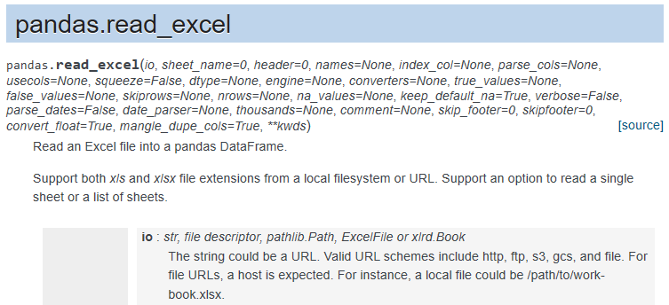

Jika teman-teman sedang mempelajari Data Science dengan Python, pasti teman-teman sudah akrab dengan pandas. Pandas (Python for Data Analysis) yakni library atau package yang umum digunakan untuk melakukan data analisis, termasuk diantaranya adalah membaca file data seperti Excel. Artikel ini dibuat untuk teman-teman yang sedang mempelajari Data Science, khususnya Exploratory Data Analysis.

Pada artikel ini, kita akan menggunakan data dari Badan Pusat Statistik Nasional (bps.go.id). Badan Pusat Statistik adalah Lembaga Pemerintah Non Kementerian yang menyediakan kebutuhan data bagi pemerintah dan masyarakat. Data ini didapatkan dari sensus atau survey yang dilakukan sendiri dan juga dari departemen atau lembaga pemerintahan lainnya sebagai data sekunder. 

Sebagai Latihan, kita akan menggunakan data "Rata‑Rata Pengeluaran per Kapita Sebulan di Daerah Perkotaan dan Perdesaan Menurut Provinsi dan Kelompok Barang" yang bisa teman-teman akses pada link berikut <https://www.bps.go.id/statictable/2014/09/08/945/rata-rata-pengeluaran-per-kapita-sebulan-di-daerah-perkotaan-dan-perdesaan-menurut-provinsi-dan-kelompok-barang-rupiah-2011-2018.html>.

Artikel ini menggunakan data update terakhir tanggal 08 Juli 2019. Pada halaman BPS tersebut, juga terdapat tombol untuk mengunduh file data yang berbentuk excel. 


Data tersebut membagi jenis pengeluaran per kapita (dalam rupiah) kedalam dua kategori, yakni Makanan dan Non makanan berikut dengan jumlahnya. Dari data tersebut kita mendapatkan data 8 tahun yakni dari tahun 2011 hingga tahun 2018. Terdapat 35 baris data yang terdiri dari 34 provinsi di Indonesia ditambah dengan Total rata-rata dari Indonesia secara keseluruhan. Apabila kita perhatikan, selain keterangan sumber data, terdapat catatan khusus, yakni " 1) Data masih bergabung dengan Provinsi Kalimantan Timur".


Dari data tersebut kita mengetahui bahwa data pengeluaran per kapita Provinsi Kalimantan Utara, pada tahun 2011 hingga 2014 masih bergabung dengan Provinsi Kalimantan Timur. Apabila kita telusuri di pencarian Web, Provinsi Kalimantan Utara memang merupakan Provinsi baru yang berdiri pada tahun 2013 setelah disahkan oleh Undang-undang Nomor 20 Tahun 2012.


Sehingga sangat wajar apabila data pengeluaran per kapita dari BPS baru terdapat pada tahun 2015. Yang menjadi masalah ialah data excel tersebut menggunakan karakter string " - " sebagai pengganti pada data Kalimantan Utara tahun 2011-2014 yang nantinya akan memengaruhi tipe data saat kita baca menggunakan pandas.

Kita akan menggunakan Jupyter Notebook sebagai lembar kerja kita. Seperti pada umumnya kita terlebih dahulu mengimpor package pandas yang umumnya kita singkat dengan pd. Sedikit tambahan agar tampilan angka koma atau float format pada tabel pandas terlihat rapi, kita akan gunakan 
```python
pd.set_option('float_format', '{:f}'.format)
```


Untuk teman-teman yang sudah pernah menggunakan pandas, tentu telah mengetahui bahwa untuk membaca excel kita dapat menggunakan fungsi `read_excel()` pada pandas. Namun, apabila kita gunakan langsung fungsi tersebut maka kita akan mendapatkan tampilan data yang sedikit berantakan.


Tentunya kita harus memiliki strategi ketika membaca data excel seperti data di atas. Seperti yang terlah kita lihat pada tampilan web maupun excel ketika membaca data tersebut ada beberapa point yang dapat kita catat, yakni :

* Terdapat judul data pada baris pertama.
* Tabel dimulai pada baris ketiga.
* Data Provinsi sebagai Index baris.
* Terdapat multilevel columns dengan format "**merge&center**".
* Data Provinsi Kalimantan Utara berisi karakter string " - " pada tahun 2011 -2014.
* Terdapat 6 baris catatan kaki yang berjarak 1 baris setelah data.


Apabila kita membaca dokumentasi pandas pada bagian keterangan fungsi `read_excel()` yang bisa teman-teman lihat pada link berikut  <https://pandas.pydata.org/pandas-docs/stable/reference/api/pandas.read_excel.html>. 



Dari dokumentasi fungsi pandas.read_excel() tersebut kita akan menggunakan beberapa parameter tambahan untuk mengatasi permasalahan data di atas, yakni :
* `skiprows=1` untuk mengabaikan baris judul di data
* `header=[1, 2]` berupa list karena kita memiliki multilevel columns yakni Kategori (Makanan/NonMakanan) serta tahun data diperoleh
* `index_col=0` untuk membuat kolom Provinsi menjadi index agar lebih mudah diolah dan dilakukan analisa
* `skipfooter=7` untuk mengabaikan catatan kaki yang terdapat pada akhir baris data

Dengan menggunakan parameter-parameter tersebut, kita dapat membaca tabel data excel tersebut dengan lebih rapi. 


Selanjutnya adalah mengganti karakter string " - " pada provinsi Kalimantan Utara dengan Nilai NaN menggunakan library Numpy. Pada kasus ini, Saya pribadi menghindari mengganti karakter " - " tersebut dengan nilai 0, karena Seperti dijelaskan pada catatan kaki, sebelum tahun 2015 data Kalimantan Utara masih bergabung dengan data Provinsi Kalimantan Timur, namun juga tidak bisa dikatakan bahwa sebelum tahun 2015  data Provinsi Kalimantan Utara adalah sama dengan data Provinsi Kalimantan Timur karena memang Provinsi tersebut belum terbentuk. Sehingga pada kasus ini saya akan menggunakan nilai `NaN` (_Not a Number_) sebagai pengganti karakter string " - " dari data BPS tersebut.


Kita juga dapat mengganti nama index dari `'Kalimantan Utara 1)'` menjadi `'Kalimantan Utara'` dengan fungsi `.rename()` kemudian kita masukkan parameter `index={'Kalimantan Utara 1)' : 'Kalimantan Utara'}` yang berupa dictionary dan jangan lupa kita gunakan juga parameter **`inplace=True`** untuk membuat keluaran dari perintah `.rename()` langsung mengganti object data tabel kita.


Kemudian kita juga harus memperhatikan datatype dari tiap tiap kolom pada tabel data kita dengan menggunakan fungsi `.info()`


Kita dapat melihat bahwa data pada tahun 2016, baik pada kategori Makanan, Nonmakanan maupun Jumlah, terbaca sebagai object string. Untuk menyelidikinya lebih lanjut, kita dapat menlihat sample data pada tahun 2016 dengan menggunakan perintah 
```python
tabel[index_col_lvl1][index_col_lvl2].values
```


Nah, kita kini mengetahui bahwa kemungkinan terdapat kesalahan pada **_input data_** yang mengakibatkan data pada tahun 2016 terdeteksi sebagai object string. Untuk mengatasinya kita dapat membuat fungsi berulang (_for loop_) dari setiap data pada kolom tersebut menjadi karakter angka, atau pada kasus ini kita akan menjadikannya tipe data **_float_**. 

Fungsi yang akan kita buat harus mengeluarkan _output_ berupa list data yang telah berbentuk float karenanya kita membuat list kosong terlebih dahulu bernama output_list. Ada dua parameter yang dibutuhkan oleh fungsi ini, yakni tabel data dan multi kolom(Karena data kita memiliki multilevel columns) yang hendak kita rubah dari string menjadi float.

Secara umum, ada 2 step yang kita lakukan dalam processing data ini, pertama adalah `.strip()` yakni menghilangkan spasi pada awal dan akhir seperti yang terlihat pada data kategori 'Makanan', kemudian kita gunakan fungsi `.replace()` yang menghilangkan spasi pada tengah-tengah angka pemisah ribuan. Perintah tersebut dilakukan berulang pada setiap baris data pada tabel kolom tersebut.


Untuk mengaplikasikan fungsi tersebut, kita dapat juga menggunakan perulangan untuk setiap kolom kategori pada tahun 2016 dengan terlebih dahulu menyimpannya kedalam sebuah list. Perulangan sebanyak tiga kali tersebut akan mengganti data pada tiap-tiap kolom dengan keluaran dari fungsi `object_to_float` yang telah kita buat sebelumnya.


Setelah selesai, kita dapat melihat bahwa tipe data kita sudah berganti dengan kembali melihat dari fungsi `.info()`


Atau juga dengan melihat sample 5 baris pertama dari tabel data dengan fungsi `.head()`


Kini data telah siap untuk teman-teman analisis. Semoga teknik yang dibahas pada artike ini dapat membantu kamu untuk mengolah data tabel terutama berupa file excel.
