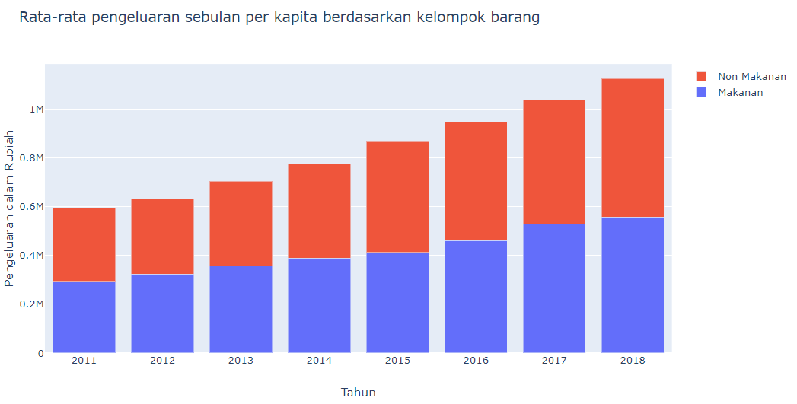

Tentu kita semua sepakat bahwa data dalam bentuk visualisasi lebih mudah dipahami daripada dalam bentuk tabel. Dalam tabel sederhana seperti gambar di bawah, cukup sulit mengetahui informasi dari data tersebut secara sekilas.

Mari kita bandingkan dengan bar chart di bawah ini

Tentunya kita langsung dapat mengetahui bahwa terjadi peningkatan jumlah pengeluaran bulanan per kapita di Indonesia yakni dari tahun 2011 sekitar 590 ribu rupiah hingga sekitar 1,1 juta rupiah pada tahun 2018.

Selamat, teman-teman kini telah mengetahui esensi dari data Visualisasi, yakni "Mengkomunikasikan informasi secara jelas dan efisien". 

Mari kita gali lebih dalam, visualisasi data di atas adalah bar chart atau bar graph. Pada bar chart setiap data point diwakili oleh batang dengan ketinggian tertentu sesuai dengan nilai data yang hendak diwakili, maka dalam bahasa Indonesia diberi istilah 'diagram batang'.

Bar chart sangat populer digunakan pada visualisasi data. Saking populernya, bar chart sering dijadikan default graph di beberapa aplikasi spreadsheet seperti barchart.

Lantas apa yang salah dengan bar chart di atas?
Bar chart umumnya digunakan ketika kita hendak membandingkan nilai dari beberapa kategorik. Pada data pengeluaran per kapita di atas, kategori yang dibandingkan adalah tahun yakni dari tahun 2011 hingga 2018. Dalam hal ini tahun bukanlah nilai kategorik, melainkan periode berjalan. [https://eazybi.com/static/img/blog_page/posts/2016_02_16/chart-selection-diagram.png] 
Maka visualisasi data tersebut lebih tepat apabila menggunakan 'Line chart' atau diagram garis.

Dengan line chart di atas, kita dapat dengan mudah melihat bahwa terjadi pertumbuhan hampir 2 kali lipat pada pengeluaran per kapita nasional dari tahun 2011 sampai dengan tahun 2019. bahkan kita bisa menambahkan narasi data yakni Laju pertumbuhan Majemuk Tahunan antara 2011 dan 2018 adalah sebesar 9,56%.

Apabila terdapat sub kategori data, umumnya kita akan menggunakan 'stacked bar chart' atau diagram batang bertingkat seperti berikut:

Sama seperti di atas, kita juga dapat menggunakan 'line chart' untuk lebih memudahkan perbandingan pada sub kategori tersebut:

Dengan line chart di atas, kita dapat dengan mudah mengetahui bahwa pada tahun 2015, terjadi lonjakan pengeluaran per kapita Nasional pada kategori Non makanan yang sebelumnya pada stack bar chart tidak terlihat.

Selain 'stack bar chart', variasi lain dari bar chart adalah 'group bar chart' yakni menggabungkan beberapa sub kategorik secara berjajar dalam satu rumpun seperti di bawah ini:

Pada 'group bar chart' di atas, visualisasi data yang ditampilkan tidak memiliki komunikasi data yang baik, pembaca tidak dapat menangkap informasi yang hendak disampaikan dengan mudah.

Kita dapat menggunakan warna ketika kita hendak menyoroti atau menonjolkan suatu informasi yang kita anggap paling penting untuk dikomunikasikan dalam bentuk grafik visualisasi, seperti grafik berikut: 

Lantas apakah bar chart jelek ? Tentu tidak, bar chart sangat efektif terutama ketika digunakan untuk menyajikan data perbandingan beberapa item kategori, serta dapat juga kita gabungkan dengan pemilihan warna sebagai 'highlight' atas informasi penting yang hendak kita komunikasikan pada grafik tersebut.

Grafik di atas hendak menampilkan rata-rata pengeluaran bulanan per kapita di pulau Jawa dengan sorotan warna yang kontras, sehingga pembaca dapat langsung mengetahui provinsi mana saja di pulau Jawa dengan pengeluaran di bawah maupun di atas rata-rata.

Konsistensi warna juga baik digunakan sebagai identitas kategori yang hendak dibandingkan. Berikut  adalah contoh perbandingan kontribusi pertumbuhan jumlah tenaga kerja pada Agustus 2017 dan Agustus 2018 berdasarkan tiap-tiap sektor ekonomi.

Semoga pembahasan mengenai bar chart di atas dapat membantu teman-teman dalam melakukan visualisasi data lebih baik lagi.