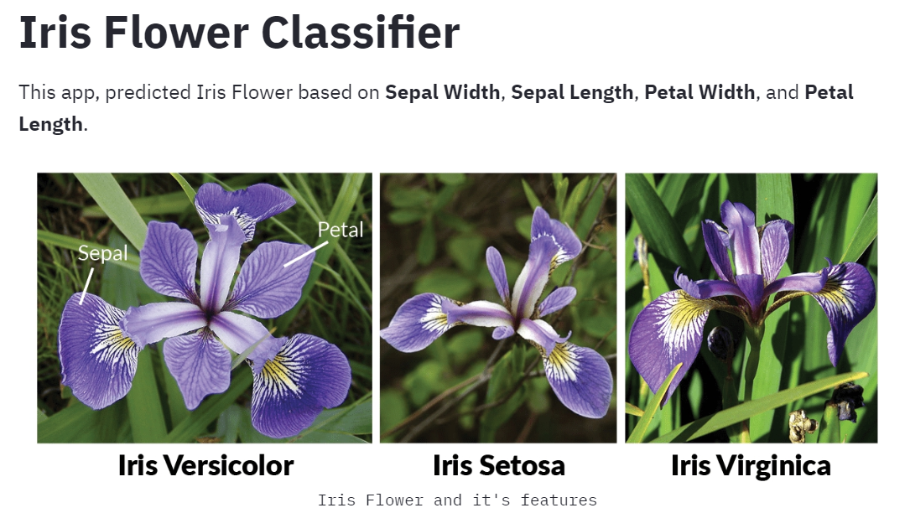
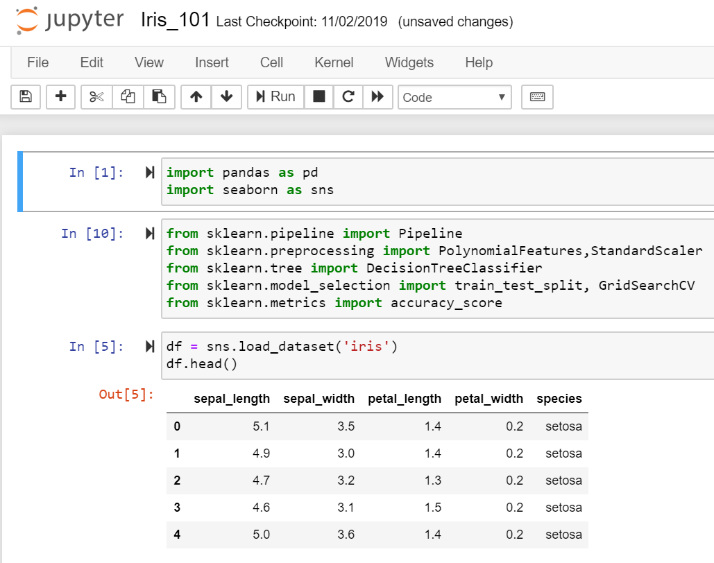
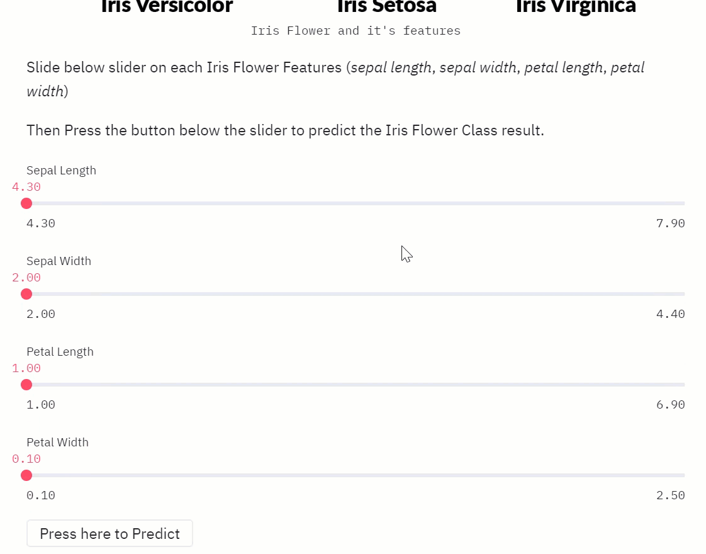

View live Apps: [https://streamlit-iris-prediction.herokuapp.com/](https://streamlit-iris-prediction.herokuapp.com/)



Iris flower prediction somehow becomes the **_“Hello World”_** of Data Science & Machine Learning. The simplicity of the dataset makes it undeniably very easy to use to learn Basic Classification in Machine Learning. It’s become more and more popular in Data Science and Machine Learning community.



But most of the time, the implementation of the Classifier is stopped in the Jupyter Notebook. You can use either statistical predictive modeling such as Logistic Regression and SVM, but you can also try using more complex algorithms such as Random Forest, Gradient Boosting, or even Neural Network.

But again, the final goal of your machine learning should be the usability. The capability to reproduce and utilize the solution is mandatory in business. There are several approaches to solve this kind of situation. 

First, is by serving the Machine Learning as API microservices. This is the most popular method to put your machine learning into productions. The second choice would be delivering the ML as Graphical User Interface, either as Desktop/Mobile Apps or Web Apps.

The simplest Web App for Data Science & Machine Learning currently is [Streamlit](https://www.streamlit.io/).
``` 
Streamlit is an open-source app framework for Machine Learning and Data Science teams. Create beautiful data apps in hours, not weeks. All in pure Python. All for free.
```
<br>



Streamlit makes the effort of creating UI Apps effortless. The built-in UI element choice is very rich, and the component rendered nicely.


View live Apps: [https://streamlit-iris-prediction.herokuapp.com/](https://streamlit-iris-prediction.herokuapp.com/)

View source code: <a href="https://github.com/BenedictusAryo/ml_app_deployment"><i class="large github icon"></i>BenedictusAryo/ml_app_deployment</a>